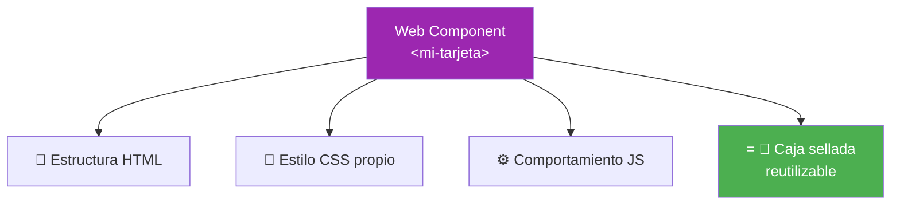
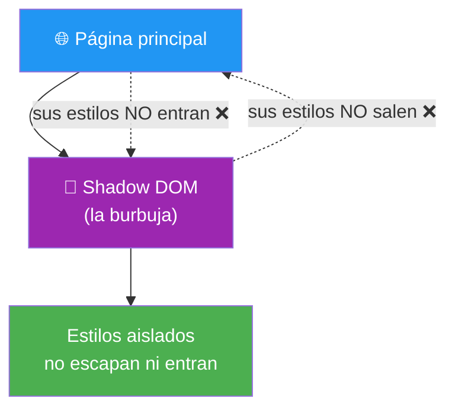
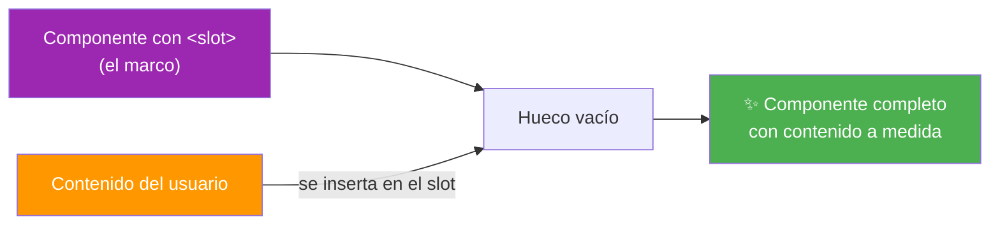
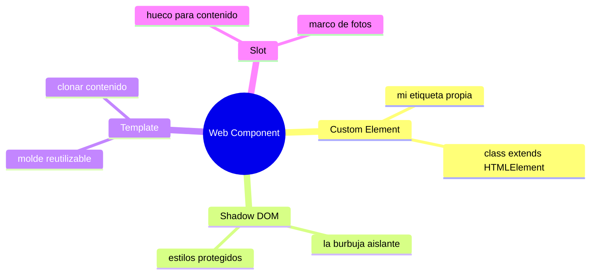

# 🧩 Módulo 30 — Web Components

> 💡 **Antes de empezar:** ¿Y si pudieras crear tus _propias_ etiquetas HTML? No solo `<div>` o `<button>`, sino `<mi-tarjeta>` o `<boton-genial>`, reutilizables en cualquier parte y con su propio estilo y comportamiento encapsulados. Eso son los Web Components: una forma nativa del navegador de crear componentes reutilizables, sin necesidad de frameworks. Es como pasar de usar piezas de LEGO prefabricadas a _diseñar tus propias piezas_ personalizadas. 🧱

---

## 🎯 ¿Qué aprenderás en este módulo?

Al terminar serás capaz de:

- Crear tus propias etiquetas HTML (Custom Elements).
- Aislar el estilo y la estructura de un componente (Shadow DOM).
- Definir plantillas reutilizables con `<template>`.
- Insertar contenido personalizado en tus componentes con `<slot>`.

> 🌱 **Nota:** Los Web Components son una tecnología nativa y poderosa, pero más _avanzada_. Conectan con el "component thinking" del Módulo 17. No siempre los usarás (muchos prefieren frameworks como React), pero entenderlos te muestra cómo el navegador resuelve la reutilización por sí mismo, sin librerías.

---

## 🧱 La idea: componentes nativos del navegador

En el Módulo 17 aprendiste a _pensar en componentes_: piezas reutilizables como bloques de LEGO. Allí los hacíamos con funciones que devolvían HTML. Los **Web Components** llevan esa idea más lejos: te dejan crear _etiquetas HTML reales y propias_, con todo (estructura, estilo, comportamiento) empaquetado dentro.

### 🎁 La metáfora de la caja sellada autosuficiente

Un Web Component es como un electrodoméstico: una caja sellada con todo dentro (cables, motor, botones). Tú solo lo enchufas y usas sus botones; no necesitas saber qué pasa adentro, y lo de adentro no interfiere con el resto de tu casa. Un componente bien hecho es así: autosuficiente y aislado.



> 🧠 **Idea clave:** Un Web Component empaqueta estructura + estilo + comportamiento en una etiqueta personalizada que puedes usar tantas veces como quieras, igual que usas `<button>`. Y lo de adentro queda _aislado_ del resto de la página.

---

## 1. Custom Elements: tus propias etiquetas

Los **Custom Elements** te permiten definir elementos HTML personalizados con su propio nombre y comportamiento. Se crean con una `class` (¡del Módulo 21!) que hereda de `HTMLElement`.

### 🏷️ La metáfora de inventar una palabra nueva

Es como añadir una palabra nueva al diccionario del navegador. Una vez "registrada", puedes usar `<mi-saludo>` en tu HTML igual que usarías `<p>` o `<div>`, y el navegador sabrá qué hacer con ella.

```javascript
// Definir el componente con una clase
class MiSaludo extends HTMLElement {
  connectedCallback() {
    // Se ejecuta cuando el elemento aparece en la página
    this.textContent = "¡Hola desde mi componente! 👋";
  }
}

// Registrar la etiqueta (el nombre DEBE tener un guion)
customElements.define("mi-saludo", MiSaludo);
```

Ahora puedes usarla en tu HTML como cualquier etiqueta:

```html
<mi-saludo></mi-saludo>
<mi-saludo></mi-saludo>  <!-- reutilizable las veces que quieras -->
```

> 🔑 **Dos detalles importantes:**
> 
> - El nombre _siempre_ lleva un guion (`mi-saludo`, no `misaludo`). Es una regla para no chocar con etiquetas oficiales.
> - `connectedCallback()` es un método especial que se ejecuta cuando el elemento se añade a la página. Es como el "encendido" del componente.

> 🔗 **Conexión:** Aquí brillan las clases del Módulo 21. Un Custom Element _es_ una clase que extiende `HTMLElement`. Todo lo que aprendiste de POO cobra utilidad real aquí.

---

## 2. Shadow DOM: el aislamiento mágico

El **Shadow DOM** es un "DOM oculto y aislado" dentro de tu componente. Su gran poder: los estilos de dentro _no escapan_ al resto de la página, y los estilos de la página _no entran_ a tu componente. Aislamiento total.

### 🫧 La metáfora de la burbuja protectora

Imagina que tu componente vive dentro de una _burbuja_. Lo que pintas dentro de la burbuja (estilos CSS) se queda dentro; no mancha el resto de la página. Y lo de afuera no entra a manchar tu burbuja. Cada componente es su propio mundo protegido.

```javascript
class TarjetaAislada extends HTMLElement {
  connectedCallback() {
    // Crear el Shadow DOM (la burbuja)
    const shadow = this.attachShadow({ mode: "open" });

    // Todo lo de aquí está AISLADO del resto de la página
    shadow.innerHTML = `
      <style>
        p { color: purple; font-size: 20px; }  /* solo afecta DENTRO */
      </style>
      <p>Soy una tarjeta con estilo propio y aislado</p>
    `;
  }
}

customElements.define("tarjeta-aislada", TarjetaAislada);
```

> 🛡️ **Por qué es tan útil:** Sin Shadow DOM, los estilos CSS son "globales": una regla puede afectar elementos por toda la página sin querer (un problema clásico en proyectos grandes). Con Shadow DOM, el estilo de tu componente _solo_ afecta a tu componente. Adiós a los conflictos de CSS.



> 🧠 **Idea clave:** El Shadow DOM resuelve uno de los dolores históricos del desarrollo web: que los estilos se "pisen" entre sí. Cada componente queda blindado en su burbuja.

---

## 3. Template: plantillas reutilizables

La etiqueta `<template>` permite definir un trozo de HTML que _no se muestra_ hasta que tú lo "actives" con JavaScript. Es ideal como molde para clonar contenido.

### 📐 La metáfora del molde guardado en el cajón

Un `<template>` es como un molde guardado en un cajón: está ahí, listo, pero no "en uso". Cuando lo necesitas, sacas una copia del molde y la usas. El original queda intacto para volver a clonarlo cuantas veces quieras.

```html
<!-- Esta plantilla NO se muestra en la página -->
<template id="molde-tarjeta">
  <div class="tarjeta">
    <h3>Título</h3>
    <p>Contenido de la tarjeta</p>
  </div>
</template>

<script>
  const molde = document.querySelector("#molde-tarjeta");

  // Clonar el contenido del molde y agregarlo a la página
  const copia = molde.content.cloneNode(true);
  document.body.appendChild(copia);
</script>
```

> 🔍 **Lo útil:** Defines el HTML _una vez_ en el template, y lo clonas las veces que quieras. Es más limpio y eficiente que escribir el mismo HTML repetido o construirlo con strings. Se usa mucho _dentro_ de Web Components para definir su estructura.

> 💡 **Conexión con rendimiento:** Clonar un template es más eficiente que armar HTML con strings repetidamente (recuerda los reflows del Módulo 25). El navegador lo optimiza bien.

---

## 4. Slot: huecos para contenido personalizado

Un `<slot>` es un "hueco" dentro de tu componente donde el usuario puede insertar _su propio_ contenido. Hace que tus componentes sean flexibles y reutilizables con contenidos distintos.

### 🖼️ La metáfora del marco de fotos

Un slot es como un marco de fotos: el marco (tu componente) tiene un _hueco_ donde cada persona pone _su propia_ foto. El marco es siempre el mismo, pero el contenido del hueco cambia según quien lo use. Así, un mismo componente sirve para mil contenidos distintos.

```javascript
class TarjetaConSlot extends HTMLElement {
  connectedCallback() {
    const shadow = this.attachShadow({ mode: "open" });
    shadow.innerHTML = `
      <style> .marco { border: 2px solid purple; padding: 10px; } </style>
      <div class="marco">
        <slot></slot>  <!-- aquí va el contenido que ponga el usuario -->
      </div>
    `;
  }
}
customElements.define("tarjeta-slot", TarjetaConSlot);
```

Y al usarlo, cada uno mete su propio contenido en el hueco:

```html
<tarjeta-slot>¡Hola, soy contenido personalizado!</tarjeta-slot>
<tarjeta-slot>Yo soy otro contenido distinto</tarjeta-slot>
```

> 🔍 **La magia:** El componente define el "marco" (el borde morado), y el `<slot>` deja que cada uso ponga lo que quiera dentro. Un solo componente, infinitos contenidos. ¡Máxima reutilización!



---

## 🧩 Todo junto: un componente completo

Así se ven las cuatro piezas trabajando en equipo:



> 🎯 **La sinergia:** Defines una _etiqueta propia_ (Custom Element), le das una estructura desde un _template_, la aíslas en una _burbuja_ (Shadow DOM), y le pones _huecos_ (slots) para contenido flexible. Juntas, crean componentes profesionales, reutilizables y aislados, ¡todo con tecnología nativa del navegador!

---

## 🛠️ Mini práctica: ¡tu turno!

Estos ejercicios necesitan un archivo HTML. 🧪

### Ejercicio 1 — Tu primera etiqueta personalizada

```html
<!DOCTYPE html>
<html>
<body>
  <mi-boton></mi-boton>
  <mi-boton></mi-boton>

  <script>
    class MiBoton extends HTMLElement {
      connectedCallback() {
        this.innerHTML = `<button>¡Haz clic! 🎉</button>`;
        this.querySelector("button").addEventListener("click", () => {
          alert("¡Funcionó tu componente!");
        });
      }
    }
    customElements.define("mi-boton", MiBoton);
  </script>
</body>
</html>
```

> 🔍 **Prueba:** Creaste tu propia etiqueta `<mi-boton>` y la usaste dos veces. ¡Cada una es un botón funcional!

### Ejercicio 2 — Componente con Shadow DOM y slot

```html
<!DOCTYPE html>
<html>
<body>
  <tarjeta-info>Este texto va dentro del componente 🎴</tarjeta-info>

  <script>
    class TarjetaInfo extends HTMLElement {
      connectedCallback() {
        const shadow = this.attachShadow({ mode: "open" });
        shadow.innerHTML = `
          <style>
            .caja { border: 2px solid teal; padding: 15px; border-radius: 8px; }
          </style>
          <div class="caja"><slot></slot></div>
        `;
      }
    }
    customElements.define("tarjeta-info", TarjetaInfo);
  </script>
</body>
</html>
```

> 🎯 **Reto:** Usa `<tarjeta-info>` tres veces con contenidos distintos. Verás que todas comparten el mismo marco (estilo aislado) pero muestran contenido diferente. ¡Slot en acción!

### Ejercicio 3 — Reflexión

Piensa en `<video>` o `<input>`: son etiquetas que el navegador trae "de fábrica", con estilo y comportamiento propios. Los Web Components te dejan crear _exactamente_ ese tipo de etiquetas, pero tuyas. Reflexiona: ¿qué componente propio te gustaría crear para tus proyectos?

---

## ✅ Checklist: ¿lo lograste?

- [ ] Creo etiquetas HTML propias con Custom Elements (clase + `define`).
- [ ] Sé que el nombre debe llevar un guion y uso `connectedCallback`.
- [ ] Aíslo estilos y estructura con Shadow DOM (la burbuja).
- [ ] Defino plantillas reutilizables con `<template>`.
- [ ] Inserto contenido flexible con `<slot>`.
- [ ] Entiendo que esto conecta con el "component thinking" del Módulo 17.

Si marcaste la mayoría, **sabes crear componentes con tecnología nativa, sin frameworks**. 💪

---

## 🌱 Reflexión final

Los Web Components representan una idea ambiciosa: que el navegador, _por sí solo_, te permita crear componentes reutilizables y aislados, sin depender de ninguna librería externa. Es la versión "nativa" del component thinking que aprendiste en el Módulo 17, llevada hasta crear tus propias etiquetas HTML. Hay algo poético en poder extender el vocabulario del navegador con palabras tuyas.

Seré honesto sobre el panorama: en la práctica, _muchos_ equipos prefieren frameworks como React, Vue o Angular para construir componentes, porque ofrecen comodidades adicionales. Los Web Components nativos se usan menos en el día a día, aunque brillan en ciertos casos (librerías de componentes que deben funcionar en _cualquier_ framework, por ejemplo). Esto no resta valor a lo que aprendiste hoy: entender los Web Components te da una comprensión profunda de _qué resuelven_ los frameworks y cómo el navegador aborda la reutilización a nivel fundamental.

Y mira lo lejos que has llegado: este módulo combinó clases (Módulo 21), el DOM (Módulo 5), el component thinking (Módulo 17) y hasta nociones de rendimiento (Módulo 25). Que puedas absorber un tema tan avanzado, integrando tantos conceptos previos, es la prueba viviente de cuánto has crecido. El principiante de hace 30 módulos no habría podido con esto; tú sí.

> 🎯 **El secreto sigue siendo el mismo:** un pasito a la vez. Hoy aprendiste a crear tus propias etiquetas HTML, una capacidad que pocos conocen a fondo. Tu caja de herramientas es ahora la de un desarrollador serio y versátil.

**¡Nos vemos en el Módulo 31!**