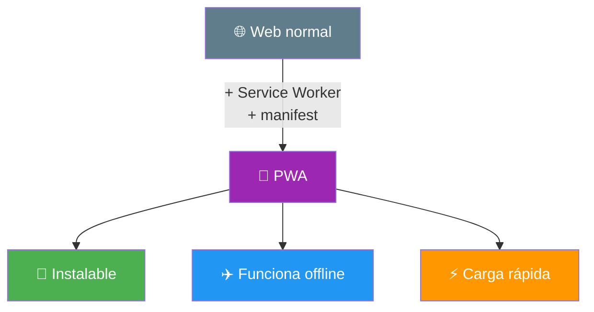
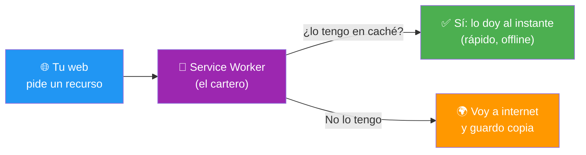
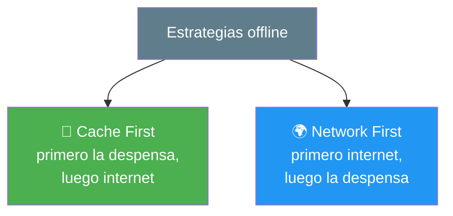
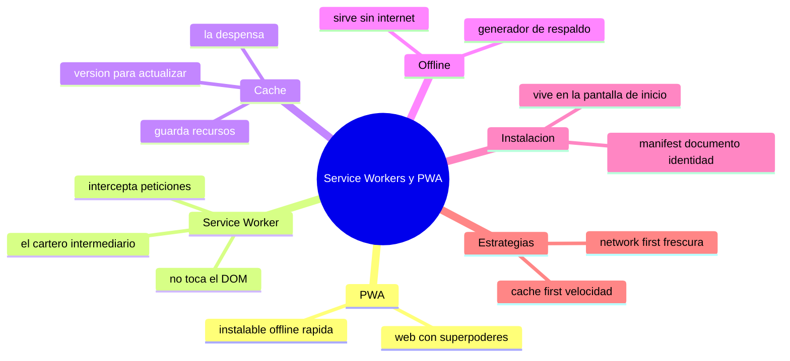

# 🧩 Módulo 31 — Service Workers y PWA

> 💡 **Antes de empezar:** ¿Te has fijado que algunas webs se pueden _instalar_ como apps, funcionan _sin internet_ y cargan rapidísimo? Eso son las PWA (Aplicaciones Web Progresivas), y su corazón son los Service Workers. Hoy aprenderás a convertir una web normal en algo que se siente como una app de verdad. Es como darle superpoderes a tu página: que viva en el teléfono, funcione offline y recuerde lo que ya cargó. 📱⚡

---

## 🎯 ¿Qué aprenderás en este módulo?

Al terminar serás capaz de:

- Entender qué es un Service Worker y su rol de "intermediario".
- Guardar recursos en caché para cargar más rápido.
- Hacer que tu app funcione _sin conexión a internet_ (offline).
- Convertir una web en una PWA instalable.
- Conocer las estrategias para servir contenido offline.

> 🌱 **Nota:** Este es un tema _avanzado_ y con varias piezas móviles. No te preocupes por dominar cada detalle técnico; el objetivo es que entiendas _qué_ son las PWA y los Service Workers, y _por qué_ son tan potentes. Es de los módulos que se aprecian más con la práctica real.

---

## 📱 ¿Qué es una PWA?

Una **PWA** (Progressive Web App) es una web que se comporta como una app nativa: se puede instalar en el dispositivo, funciona offline, carga rápido y puede enviar notificaciones. Lo mejor: sigue siendo una web (no necesita tiendas de apps), pero con superpoderes.

### 🦸 La metáfora de la web con capa de superhéroe

Una web normal es como una persona común. Una PWA es esa misma persona con una _capa de superhéroe_: ahora puede instalarse, volar sin internet (offline) y aparecer en tu pantalla de inicio. Por debajo sigue siendo una web, pero con habilidades extra.



---

## 1. Service Worker: el intermediario inteligente

Un **Service Worker** es un script que corre en segundo plano (como un worker del Módulo 29) y actúa como _intermediario_ entre tu web y la red. Puede interceptar las peticiones, guardar recursos y servirlos incluso sin internet.

### 📮 La metáfora del cartero personal con almacén

Imagina un cartero personal que se sienta _entre_ tú y la oficina de correos (internet). Cuando pides algo, él revisa primero en su propio almacén: si ya lo tiene guardado, te lo da al instante (rápido, sin internet). Si no, va a buscarlo a la oficina y de paso guarda una copia para la próxima. El Service Worker es ese cartero inteligente.



> 🧠 **Idea clave:** El Service Worker se "mete en medio" de cada petición de tu web. Eso le da el poder de responder con cosas guardadas (caché) en vez de ir siempre a internet, lo que hace tu app más rápida y capaz de funcionar offline.

> ⚠️ **Igual que los Web Workers:** el Service Worker corre aparte y _no puede tocar el DOM_ directamente. Su trabajo es gestionar peticiones y caché, no la interfaz.

**Registrar un Service Worker** (en tu archivo principal):

```javascript
if ("serviceWorker" in navigator) {
  navigator.serviceWorker.register("/sw.js")
    .then(() => console.log("Service Worker registrado ✅"))
    .catch((err) => console.log("Error al registrar", err));
}
```

> 🔍 **Nota:** Primero comprobamos si el navegador soporta Service Workers (`"serviceWorker" in navigator`), por si acaso. Luego registramos el archivo del worker. Esto activa al "cartero".

---

## 2. Cache: guardar recursos para ir más rápido

La **caché** (cache) es el "almacén" del Service Worker donde guarda copias de archivos (HTML, CSS, JS, imágenes). Así, en visitas siguientes, los sirve desde ahí —al instante— en vez de descargarlos de nuevo.

### 🏪 La metáfora de la despensa de casa

La caché es como tu despensa: en vez de ir al supermercado (internet) cada vez que necesitas algo, guardas provisiones en casa. Cuando las necesitas, las tomas al instante de la despensa. Más rápido y, si el supermercado está cerrado (sin internet), igual tienes comida.

```javascript
// Dentro del Service Worker (sw.js)
const CACHE = "mi-app-v1";
const archivos = ["/", "/index.html", "/estilos.css", "/app.js"];

// Al instalarse, guarda los archivos esenciales en la caché
self.addEventListener("install", (evento) => {
  evento.waitUntil(
    caches.open(CACHE).then((cache) => cache.addAll(archivos))
  );
});
```

> 🔍 **Qué pasa:** Cuando el Service Worker se instala, abre una caché y guarda los archivos esenciales de tu app. Desde ese momento, esos archivos están "en la despensa", listos para servirse rapidísimo o sin internet.

> 💡 **El truco del nombre con versión:** Fíjate en `"mi-app-v1"`. Cuando actualizas tu app, cambias a `"v2"`, y así el Service Worker sabe que debe renovar la despensa con los archivos nuevos. Es la forma de manejar actualizaciones.

---

## 3. Offline mode: funcionar sin internet

Aquí está la magia más impresionante: con la caché lista, el Service Worker puede _servir tu app sin conexión_. Intercepta las peticiones y responde desde la despensa cuando no hay internet.

### 🔌 La metáfora del generador de respaldo

Cuando se va la luz (se cae internet), un generador de respaldo mantiene encendido lo esencial. El Service Worker es ese generador: aunque no haya conexión, sirve los archivos guardados para que tu app siga funcionando, al menos en lo que ya tenía cargado.

```javascript
// Dentro del Service Worker (sw.js)
self.addEventListener("fetch", (evento) => {
  evento.respondWith(
    // Primero busca en la caché; si no está, va a internet
    caches.match(evento.request).then((respuesta) => {
      return respuesta || fetch(evento.request);
    })
  );
});
```

> 🔍 **La lógica:** Cada vez que la web pide algo, el Service Worker intercepta (`fetch`). Primero mira si lo tiene en caché (`caches.match`); si sí, lo devuelve (¡funciona offline!); si no, lo busca en internet. Simple y poderoso.

> 🎯 **El resultado para el usuario:** Tu app abre y funciona aunque esté en modo avión o sin señal, al menos con el contenido ya guardado. Para apps de notas, lectores, juegos sencillos... esto es una experiencia transformadora.

---

## 4. Instalación: la web que vive en el teléfono

Para que tu web sea _instalable_ (aparezca en la pantalla de inicio como una app), necesita un archivo extra: el **manifest**, que describe el nombre, ícono y apariencia de la app.

### 🪪 La metáfora del documento de identidad de la app

El manifest es como el documento de identidad de tu app: dice cómo se llama, qué ícono usar, de qué color es. Con él, el navegador sabe cómo "presentar" tu web como una app instalable.

```json
{
  "name": "Mi Aplicación",
  "short_name": "MiApp",
  "start_url": "/",
  "display": "standalone",
  "background_color": "#ffffff",
  "icons": [
    { "src": "/icono.png", "sizes": "192x192", "type": "image/png" }
  ]
}
```

Y se enlaza en el HTML:

```html
<link rel="manifest" href="/manifest.json">
```

> 🔍 **Qué logra:** Con un Service Worker (para offline) + un manifest (para la identidad), el navegador ofrece al usuario "Instalar esta app". Al hacerlo, aparece en su pantalla de inicio con su ícono, y se abre como una app independiente, sin la barra del navegador.

> 💡 **`display: standalone`:** Esta opción hace que la app se abra "sola", sin la barra de direcciones del navegador, dándole ese aspecto de app nativa.

---

## 5. Estrategias offline: cómo decidir qué servir

No siempre quieres servir lo mismo de la caché. Hay distintas **estrategias** según el tipo de contenido. Veamos las principales de forma sencilla.



- **Cache First (primero caché):** busca primero en la despensa; solo va a internet si no lo tiene. _Ideal para:_ recursos que no cambian (logos, estilos, librerías). Rapidísimo.
    
- **Network First (primero red):** busca primero en internet (para tener lo más fresco); si no hay conexión, usa la caché. _Ideal para:_ contenido que cambia seguido (noticias, mensajes). Prioriza estar actualizado.
    

> 🧠 **La idea detrás:** Eliges la estrategia según _qué tan importante es la frescura_ del recurso. ¿Es algo que casi nunca cambia? Cache First (velocidad). ¿Es algo que debe estar actualizado? Network First (frescura). Es una decisión de equilibrio entre rapidez y actualidad.

> 😌 **No te abrumes con las estrategias:** Hay más variantes, pero estas dos cubren la mayoría de los casos. Lo importante es entender el _concepto_: decidir conscientemente cuándo priorizar la caché y cuándo la red.

---

## 🛠️ Mini práctica: ¡tu turno!

> 📌 **Nota importante:** Los Service Workers requieren un _servidor_ (no funcionan abriendo el archivo directamente) y HTTPS (o localhost). Usa una herramienta como "Live Server" para probarlos. Estos ejemplos muestran la _estructura_; experimentar con ellos requiere un poco de configuración.

### Ejercicio 1 — Registra un Service Worker

**`index.html`:**

```html
<!DOCTYPE html>
<html>
<body>
  <h1>Mi primera PWA</h1>
  <script>
    if ("serviceWorker" in navigator) {
      navigator.serviceWorker.register("/sw.js")
        .then(() => console.log("✅ Service Worker activo"))
        .catch((e) => console.log("Error:", e));
    }
  </script>
</body>
</html>
```

**`sw.js`:**

```javascript
self.addEventListener("install", () => {
  console.log("Service Worker instalado 🎉");
});

self.addEventListener("fetch", (evento) => {
  // Por ahora, solo deja pasar las peticiones normalmente
  evento.respondWith(fetch(evento.request));
});
```

> 🔍 **Explora:** Abre las DevTools → pestaña **Application** → **Service Workers**. Ahí verás tu Service Worker registrado y activo. ¡Es tu ventana a este mundo!

### Ejercicio 2 — Reflexión

Piensa en apps que usas en el teléfono que en realidad son PWA (muchas lo son sin que lo notes): apps de noticias, de notas, ciertos juegos. ¿Por qué les conviene funcionar offline y ser instalables? Identificar estas tecnologías en el mundo real afianza tu comprensión.

> 💡 **Reto mental:** Si fueras a convertir uno de tus proyectos (la TODO app, por ejemplo) en PWA, ¿qué archivos guardarías en caché para que funcione offline? (Pista: el HTML, CSS y JS principales).

---

## 🧭 Resumen visual del módulo



---

## ✅ Checklist: ¿lo lograste?

- [ ] Entiendo qué es una PWA y sus superpoderes (instalable, offline, rápida).
- [ ] Sé que un Service Worker es un intermediario entre la web y la red.
- [ ] Comprendo cómo la caché guarda recursos para ir más rápido.
- [ ] Entiendo cómo una app puede funcionar sin internet.
- [ ] Conozco el manifest y su papel en la instalación.
- [ ] Distingo las estrategias Cache First y Network First.

Si marcaste la mayoría, **sabes cómo convertir una web en una app instalable y offline**. 💪

---

## 🌱 Reflexión final

Las PWA representan una idea poderosa: que la web —abierta, sin tiendas de apps, accesible desde un enlace— pueda ofrecer experiencias tan ricas como las apps nativas. Instalable, offline, rápida... y sigue siendo "solo una web". Esa democratización es hermosa: cualquiera puede crear algo que viva en el teléfono de sus usuarios sin pasar por intermediarios.

Seré honesto sobre la dificultad: este es uno de los módulos con _más piezas móviles_ del curso. Service Workers, caché, manifest, estrategias... son varios conceptos nuevos a la vez, y además requieren un servidor para probarlos. Es completamente normal si necesitas releerlo o si los detalles técnicos no se asientan a la primera. Lo verdaderamente importante hoy es la _comprensión general_: saber que existe esta tecnología, qué hace cada pieza a grandes rasgos, y qué problemas resuelve. Los detalles los dominarás cuando construyas tu primera PWA de verdad.

Y nota, una vez más, cómo todo se entrelaza: el Service Worker es pariente del Web Worker (Módulo 29), la caché conecta con tus ideas de rendimiento (Módulo 25), y las peticiones interceptadas se basan en el `fetch` que ya dominas (Módulo 12). Cada módulo nuevo no parte de cero; se construye sobre los cimientos que ya tienes. Eso es aprender de verdad.

> 🎯 **El secreto sigue siendo el mismo:** un pasito a la vez. Hoy exploraste cómo darle a una web los poderes de una app nativa. Es un tema grande, así que sé paciente contigo: con la práctica, estas piezas encajarán y podrás crear apps que tus usuarios lleven siempre consigo.

**¡Nos vemos en el Módulo 32!**