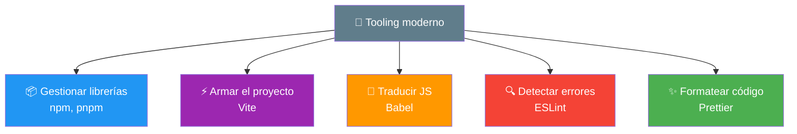
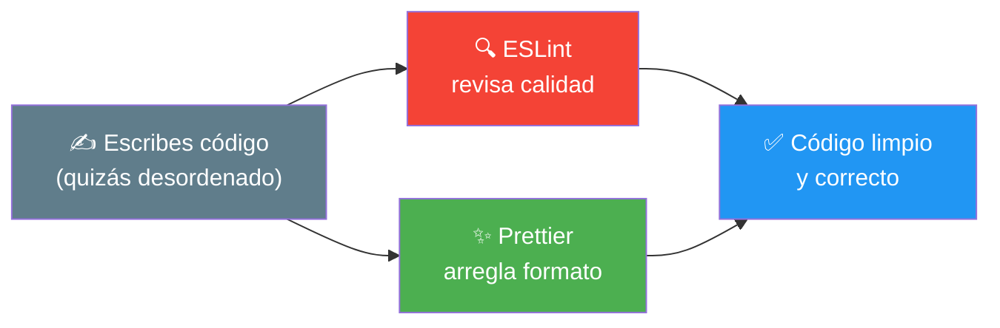
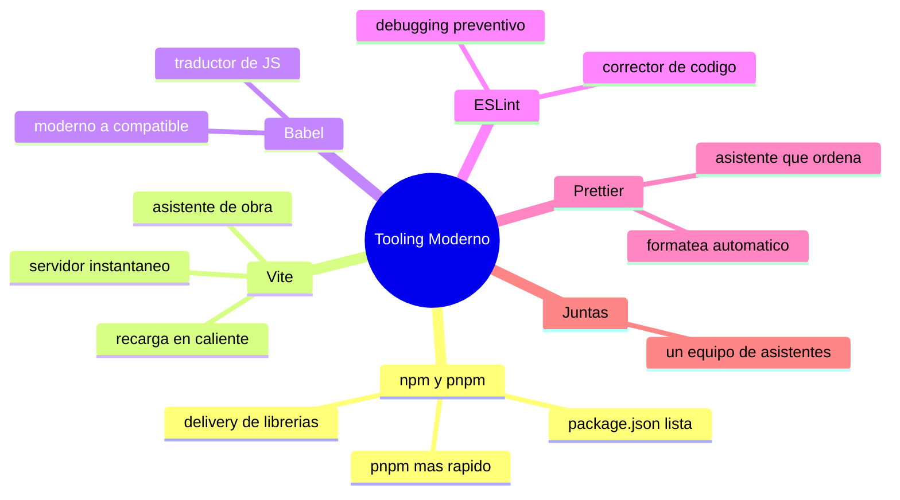

# 🧩 Módulo 32 — Tooling Moderno

> 💡 **Antes de empezar:** Hasta ahora escribiste código y lo abriste directo en el navegador. Funciona genial para aprender, pero los proyectos profesionales usan un conjunto de _herramientas_ que automatizan tareas tediosas: instalar librerías, optimizar el código, detectar errores, mantener un estilo limpio. Hoy conocerás ese "taller" moderno. No te asustes por los nombres raros: cada herramienta resuelve un problema concreto y te hace la vida más fácil. Es como pasar de cocinar con un solo cuchillo a tener una cocina equipada con todos los electrodomésticos. 🍳⚙️

---

## 🎯 ¿Qué aprenderás en este módulo?

Al terminar serás capaz de:

- Entender qué hacen npm y pnpm (gestores de paquetes).
- Conocer Vite, la herramienta que arma y sirve tu proyecto.
- Saber para qué sirve Babel (traductor de JavaScript).
- Usar ESLint (detector de errores) y Prettier (formateador automático).

> 🌱 **Nota:** Este módulo es más _panorámico_ que práctico: el objetivo es que entiendas _qué hace cada herramienta y por qué existe_, no memorizar comandos. Cuando empieces un proyecto profesional, sabrás reconocer estas piezas y para qué sirven. Es un mapa del taller, no un manual de cada máquina.

---

## 🧰 ¿Por qué necesitamos herramientas?

Escribir código es solo una parte del trabajo. Alrededor hay tareas repetitivas: traer librerías que otros hicieron, juntar muchos archivos en uno optimizado, revisar que no haya errores, mantener todo bien formateado. Hacer eso a mano sería lento y propenso a errores. Las herramientas lo automatizan.

### 👨‍🍳 La metáfora de la cocina profesional

Un cocinero casero puede hacer maravillas con lo básico. Pero una cocina profesional tiene batidoras, hornos industriales, lavavajillas... cada aparato automatiza una tarea para que el chef se concentre en _cocinar_. Las herramientas de desarrollo son esos electrodomésticos: liberan tu tiempo de lo tedioso para que pienses en lo que importa.



---

## 1. npm y pnpm: los gestores de paquetes

**npm** (Node Package Manager) es la herramienta que descarga e instala _librerías_ (código que otros programadores ya escribieron y comparten). En lugar de reinventar todo, usas piezas listas. **pnpm** es una alternativa que hace lo mismo pero más rápido y ahorrando espacio.

### 📦 La metáfora del servicio de delivery de ingredientes

Imagina que necesitas un ingrediente especial. En vez de cultivarlo tú, lo pides a un servicio de delivery que te lo trae a casa. npm es ese servicio: pides una librería (`npm install nombre`) y la trae a tu proyecto, lista para usar. Hay millones de "ingredientes" disponibles, hechos por la comunidad.

```bash
# Instalar una librería con npm
npm install nombre-libreria

# Lo mismo con pnpm (más rápido y eficiente)
pnpm install nombre-libreria
```

> 🔍 **Qué pasa:** El comando descarga la librería y la guarda en una carpeta llamada `node_modules`, registrando lo que usas en un archivo `package.json` (la "lista de ingredientes" de tu proyecto).

> 💡 **¿npm o pnpm?** npm viene incluido con Node.js y es el más usado. pnpm hace lo mismo pero es más rápido y _no duplica_ librerías entre proyectos (ahorra mucho espacio en disco). Para empezar, npm está perfecto; pnpm es una optimización que apreciarás con varios proyectos.

> 🧠 **Conexión:** ¿Recuerdas `import`/`export` del Módulo 17? Cuando instalas una librería, la traes a tu código con un `import`. Las herramientas y el código que escribes trabajan juntos.

---

## 2. Vite: el armador veloz del proyecto

**Vite** es una herramienta que _arma y sirve_ tu proyecto durante el desarrollo. Crea un servidor local instantáneo, junta tus archivos, y refresca el navegador automáticamente cuando guardas un cambio. Es rapidísimo y la opción moderna favorita.

### 🏗️ La metáfora del asistente de obra

Vite es como un asistente de construcción incansable: arma tu proyecto, te da una "vista en vivo" mientras trabajas, y cada vez que cambias algo, lo actualiza al instante en pantalla. No tienes que recargar a mano ni juntar archivos manualmente; él se encarga.

```bash
# Crear un proyecto nuevo con Vite
npm create vite@latest mi-proyecto

# Entrar y arrancar el servidor de desarrollo
cd mi-proyecto
npm install
npm run dev
```

> 🔍 **Qué te da Vite:**
> 
> - **Servidor de desarrollo instantáneo:** ves tu proyecto en `localhost` al momento.
> - **Recarga en caliente:** guardas un archivo y el navegador se actualiza solo, sin perder tu lugar.
> - **Optimización para producción:** cuando terminas, junta y comprime todo para que cargue rápido.

> 🎯 **Por qué importa:** Cuando tu proyecto crece (varios archivos, librerías, módulos), abrir el HTML directo deja de ser práctico. Vite organiza todo eso por ti y hace que desarrollar sea fluido y agradable.

---

## 3. Babel: el traductor de JavaScript

**Babel** es un "traductor" que convierte JavaScript _moderno_ en JavaScript que entienden incluso navegadores _antiguos_. Te deja usar las últimas características del lenguaje sin preocuparte por la compatibilidad.

### 🌐 La metáfora del traductor de idiomas

Imagina que escribes una carta en un español muy moderno, lleno de palabras nuevas. Babel es un traductor que la reescribe en un español "clásico" que _todos_ entienden, incluso los más mayores. Así, tú escribes con lo último, y Babel se asegura de que cualquier navegador lo comprenda.

```javascript
// Tú escribes JavaScript moderno (arrow functions, etc.)
const saludar = (nombre) => `Hola ${nombre}`;

// Babel lo traduce a una versión más "clásica" y compatible:
// var saludar = function(nombre) { return "Hola " + nombre; };
```

> 🔍 **Por qué es útil:** El JavaScript evoluciona constantemente, pero no todos los usuarios tienen navegadores actualizados. Babel te permite usar las características modernas _hoy_, traduciéndolas a algo que funcione en todas partes. Tú escribes bonito; Babel garantiza compatibilidad.

> 😌 **No te preocupes por configurarlo:** Hoy en día, herramientas como Vite suelen incluir esta traducción automáticamente por debajo. Rara vez configurarás Babel a mano al empezar. Basta con saber _qué hace_ y _por qué existe_.

---

## 4. ESLint: el detector de errores y malas prácticas

**ESLint** es una herramienta que _revisa tu código_ mientras lo escribes y te avisa de errores, problemas potenciales y malas prácticas, _antes_ de que ejecutes nada. Es como un corrector que trabaja a tu lado.

### 🔍 La metáfora del corrector ortográfico

ESLint es como el corrector ortográfico de un procesador de texto, pero para código: subraya los problemas mientras escribes. "Esta variable no se usa", "olvidaste un punto y coma", "esto podría causar un bug". Te ayuda a escribir mejor _antes_ de que las cosas fallen.

```javascript
// ESLint te avisaría de cosas como:
let nombre = "Ana";   // ⚠️ "nombre" se declara pero nunca se usa
console.log(nombe);   // ⚠️ "nombe" no existe (¿quisiste decir "nombre"?)
```

> 🛡️ **Por qué es valioso:** ESLint atrapa errores _antes_ de que se conviertan en bugs. Es como tener a un programador experto mirando por encima de tu hombro, señalando problemas con amabilidad. En equipos, también asegura que todos sigan las mismas reglas de calidad.

> 🔗 **Conexión:** ¿Recuerdas el Módulo 10 sobre debugging? ESLint es debugging _preventivo_: en vez de buscar errores después, los previene mientras escribes. ¡Menos bugs que cazar más tarde!

---

## 5. Prettier: el formateador automático

**Prettier** es una herramienta que _formatea_ tu código automáticamente: arregla la indentación, los espacios, las comillas, los saltos de línea... todo, con solo guardar. Tu código siempre queda limpio y consistente sin esfuerzo.

### ✨ La metáfora del asistente que ordena tu escritorio

Prettier es como un asistente que, cada vez que terminas de trabajar, ordena tu escritorio: alinea los papeles, endereza los lápices, deja todo impecable. Tú solo escribes (aunque quede desordenado), guardas, y Prettier lo deja perfecto al instante.

```javascript
// Antes (desordenado):
const persona={nombre:"Ana",edad:25,activo:true}

// Después de guardar con Prettier (ordenado automáticamente):
const persona = {
  nombre: "Ana",
  edad: 25,
  activo: true,
};
```

> 🎯 **Por qué es genial:** Dejas de perder tiempo formateando a mano y dejas de discutir sobre estilo en equipo (¿comillas simples o dobles? ¿2 o 4 espacios?). Prettier decide y aplica todo de forma consistente. Tú te concentras en la lógica; él se encarga de la presentación.

> 💡 **ESLint + Prettier, el dúo perfecto:** ESLint cuida la _calidad_ (errores, malas prácticas) y Prettier cuida el _formato_ (apariencia). Juntos mantienen tu código limpio y correcto. Casi todos los proyectos profesionales usan ambos.



---

## 🧭 El taller completo: cómo trabajan juntas

Estas herramientas no compiten; _colaboran_ en un flujo de trabajo:

|Herramienta|Su trabajo|Metáfora|
|---|---|---|
|**npm / pnpm**|Traer librerías|Delivery de ingredientes|
|**Vite**|Armar y servir el proyecto|Asistente de obra|
|**Babel**|Traducir JS moderno|Traductor de idiomas|
|**ESLint**|Detectar errores y malas prácticas|Corrector ortográfico|
|**Prettier**|Formatear automáticamente|Asistente que ordena|

> 🧠 **El flujo típico:** Usas **npm/pnpm** para traer librerías, **Vite** para desarrollar con vista en vivo, **Babel** (por debajo, vía Vite) traduce tu código moderno, **ESLint** te avisa de problemas mientras escribes, y **Prettier** deja todo formateado al guardar. Un equipo de asistentes trabajando para ti.

---

## 🛠️ Mini práctica: ¡tu turno!

> 📌 **Nota:** Estas herramientas requieren tener **Node.js** instalado en tu computadora. Si quieres experimentar de verdad, instala Node.js (desde su web oficial) y prueba estos comandos en una terminal.

### Ejercicio 1 — Crea un proyecto con Vite

En tu terminal, prueba:

```bash
npm create vite@latest mi-primer-proyecto
cd mi-primer-proyecto
npm install
npm run dev
```

> 🔍 **Observa:** Vite te dará una dirección como `http://localhost:5173`. Ábrela y verás tu proyecto. Cambia algo en el código, guarda, ¡y mira cómo se actualiza solo! Esa es la "recarga en caliente".

### Ejercicio 2 — Explora un package.json

Cuando creas un proyecto, aparece un archivo `package.json`. Ábrelo y observa: lista las librerías que usa tu proyecto (dependencies) y los comandos disponibles (scripts). Es la "ficha técnica" de tu proyecto.

### Ejercicio 3 — Reflexión

Hasta ahora abriste tus archivos HTML directo en el navegador, y funcionó perfecto para aprender. Reflexiona: ¿en qué momento crees que un proyecto se vuelve lo bastante grande como para necesitar estas herramientas? (Pista: cuando hay muchos archivos, librerías externas, o trabajas en equipo).

---

## 🧭 Resumen visual del módulo



---

## ✅ Checklist: ¿lo lograste?

- [ ] Entiendo que npm/pnpm traen librerías a mi proyecto.
- [ ] Sé que Vite arma y sirve el proyecto con recarga en caliente.
- [ ] Comprendo que Babel traduce JS moderno a versiones compatibles.
- [ ] Sé que ESLint detecta errores y malas prácticas al escribir.
- [ ] Sé que Prettier formatea mi código automáticamente.
- [ ] Entiendo cómo estas herramientas colaboran en un flujo de trabajo.

Si marcaste la mayoría, **conoces el taller que usan los desarrolladores profesionales**. 💪

---

## 🌱 Reflexión final

Este módulo te mostró el "detrás de escena" del desarrollo profesional. Esas herramientas con nombres raros que ves mencionadas por todas partes —npm, Vite, ESLint— dejaron de ser un misterio: ahora sabes que cada una resuelve un problema concreto y trabaja para hacerte la vida más fácil. No son obstáculos que aprender; son aliados que automatizan lo tedioso.

Quiero darte una perspectiva tranquilizadora. Que estas herramientas existan _no_ significa que todo lo que hiciste hasta ahora "estuvo mal". Abrir archivos HTML en el navegador fue la forma _correcta_ de aprender los fundamentos, sin distracciones. Las herramientas tienen sentido _cuando los proyectos crecen_: muchos archivos, librerías externas, trabajo en equipo. Aprenderlas ahora, _después_ de dominar las bases, es el orden ideal. Quien empieza por las herramientas sin entender el código se pierde; tú llegas a ellas con cimientos sólidos.

Y no te abrumes intentando memorizar comandos o configuraciones. La belleza de estas herramientas es que, una vez configuradas (a menudo Vite lo hace casi todo por ti), trabajan en silencio mientras tú te concentras en programar. Lo importante hoy era el _mapa mental_: saber qué hace cada pieza. Los detalles los irás dominando naturalmente al usarlas en proyectos reales.

> 🎯 **El secreto sigue siendo el mismo:** un pasito a la vez. Hoy conociste el taller profesional. No tienes que dominar cada herramienta de inmediato; basta con saber que están ahí, listas para potenciar tu trabajo cuando las necesites.

**¡Nos vemos en el Módulo 33!**