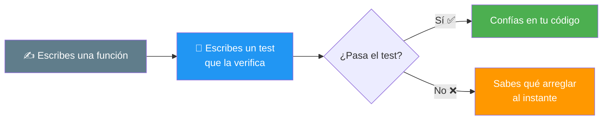
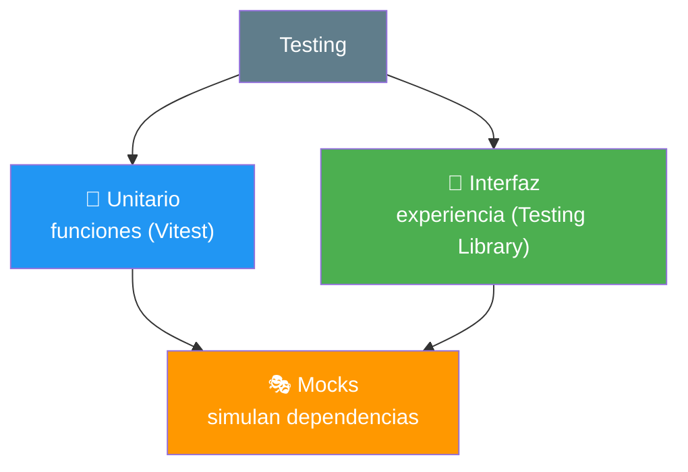
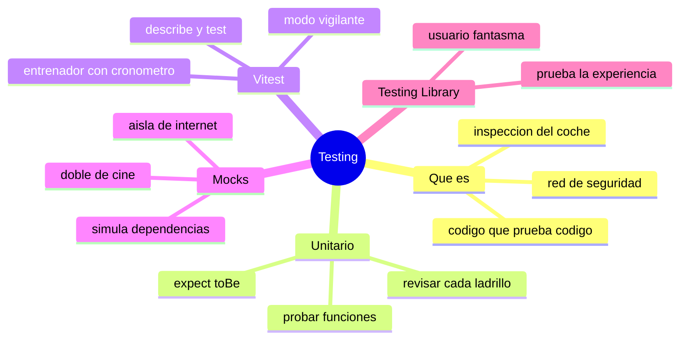

# 🧩 Módulo 33 — Testing

> 💡 **Antes de empezar:** Hasta ahora comprobabas que tu código funcionaba _ejecutándolo y mirando_ el resultado. Funciona, pero ¿qué pasa cuando tu proyecto tiene cientos de funciones? Probar todo a mano cada vez sería imposible. La solución profesional es el _testing_: escribir código que _prueba_ tu código automáticamente. Suena extraño al principio (¿código que prueba código?), pero es una de las prácticas que más tranquilidad y calidad aportan. Es como tener un inspector que revisa que todo funcione antes de cada entrega. ✅🔍

---

## 🎯 ¿Qué aprenderás en este módulo?

Al terminar serás capaz de:

- Entender qué es el testing y por qué da tanta tranquilidad.
- Escribir pruebas unitarias (probar funciones individuales).
- Usar Vitest, una herramienta moderna de testing.
- Comprender qué son los mocks (simulaciones).
- Conocer Testing Library para probar la interfaz.

> 🌱 **Nota:** El testing es una práctica profesional muy valiosa pero _no_ esencial para empezar a programar. Considéralo una habilidad que te eleva de "hago código que funciona" a "hago código en el que confío". Este módulo te da la idea y los fundamentos; la maestría llega con la práctica.

---

## 🛡️ ¿Qué es el testing y por qué importa?

El **testing** consiste en escribir código adicional cuyo único trabajo es _verificar_ que tu código principal funciona correctamente. Estas pruebas se ejecutan automáticamente y te avisan si algo se rompió.

### 🚗 La metáfora de la inspección del coche

Antes de que un coche salga de fábrica, pasa por inspecciones automáticas: ¿frenan bien las ruedas?, ¿encienden las luces?, ¿funciona el motor? El testing es eso para tu código: una batería de comprobaciones que verifican que cada parte hace lo que debe, _antes_ de entregarlo a los usuarios.



> 🧠 **El gran beneficio — dormir tranquilo:** El verdadero valor del testing aparece cuando _cambias_ algo. ¿Modificaste una función y temes haber roto otra cosa? Ejecutas los tests: si todos pasan en verde, respiras tranquilo. Si alguno falla, sabes _exactamente_ qué se rompió. Es una red de seguridad que te da confianza para mejorar tu código sin miedo.

---

## 1. Testing unitario: probar piezas individuales

El **testing unitario** consiste en probar las piezas más pequeñas de tu código —normalmente funciones individuales— de forma aislada. "Unitario" porque pruebas una _unidad_ a la vez.

### 🧱 La metáfora de revisar cada ladrillo

Antes de construir una pared, revisas que _cada ladrillo_ esté bien. Si cada ladrillo es sólido, la pared será sólida. El testing unitario revisa cada "ladrillo" (función) por separado: le das una entrada, y compruebas que devuelve la salida esperada.

La estructura de un test es siempre la misma idea: _"cuando le doy ESTO, espero que devuelva AQUELLO"_.

```javascript
// La función que queremos probar
function sumar(a, b) {
  return a + b;
}

// El test: "cuando sumo 2 y 3, ESPERO que dé 5"
test("sumar dos números", () => {
  expect(sumar(2, 3)).toBe(5);
});
```

> 🔍 **Desglose de las piezas:**
> 
> - `test("descripción", función)` → define una prueba con un nombre claro.
> - `expect(...)` → "espero que esto..."
> - `.toBe(5)` → "...sea igual a 5".
> 
> Se lee casi como inglés natural: _"espero que sumar(2,3) sea 5"_. Si lo es, el test pasa (verde); si no, falla (rojo) y te dice qué esperaba vs qué obtuvo.

> 🎯 **La filosofía:** Pruebas casos normales (`sumar(2,3)`), pero también casos límite (`sumar(0,0)`, números negativos, etc.). Pensar en qué podría salir mal te hace escribir mejor código desde el principio.

---

## 2. Vitest: la herramienta moderna de testing

**Vitest** es una herramienta moderna y rápida para escribir y ejecutar tests en proyectos JavaScript. Se integra muy bien con Vite (del Módulo 32) y hace que testear sea sencillo.

### 🏃 La metáfora del entrenador con cronómetro

Vitest es como un entrenador que ejecuta todas tus pruebas y te da un reporte: "5 tests pasaron ✅, 1 falló ❌, y el que falló esperaba 5 pero obtuvo 6". Es rápido, claro, y se ejecuta solo cada vez que cambias algo.

```javascript
// archivo: matematicas.test.js
import { describe, test, expect } from "vitest";
import { sumar, restar } from "./matematicas.js";

// "describe" agrupa tests relacionados
describe("operaciones matemáticas", () => {
  test("suma correctamente", () => {
    expect(sumar(2, 3)).toBe(5);
  });

  test("resta correctamente", () => {
    expect(restar(10, 4)).toBe(6);
  });
});
```

> 🔍 **Cómo se organiza:** `describe` agrupa tests relacionados (todos los de "operaciones matemáticas" juntos), y cada `test` prueba un comportamiento concreto. Al ejecutar `vitest`, ves un reporte coloreado de qué pasó y qué falló.

> 💡 **Lo cómodo:** Vitest puede correr en "modo vigilante": cada vez que guardas un cambio, _re-ejecuta los tests automáticamente_. Así sabes al instante si rompiste algo. Es como tener el inspector trabajando contigo en tiempo real.

```bash
# Ejecutar los tests
npx vitest
```

---

## 3. Mocks: simulaciones para probar en aislamiento

Un **mock** (simulación) es una versión "falsa" de algo, creada para probar tu código sin depender de cosas externas reales (como internet o una base de datos).

### 🎭 La metáfora del doble de cine

En las películas, un _doble de acción_ reemplaza al actor en escenas peligrosas. Se ve y actúa parecido, pero no es el actor real. Un mock es ese doble: reemplaza algo real (una API, por ejemplo) con una versión controlada y predecible, para que puedas probar tu código sin riesgos ni dependencias.

```javascript
// Imagina una función que pide datos a internet con fetch
async function obtenerUsuario() {
  const res = await fetch("https://api.ejemplo.com/usuario");
  return res.json();
}

// En el test, NO queremos llamar a internet de verdad.
// Usamos un mock que simula la respuesta:
test("obtiene un usuario", async () => {
  // Reemplazamos fetch con una versión falsa controlada
  global.fetch = vi.fn(() =>
    Promise.resolve({ json: () => Promise.resolve({ nombre: "Ana" }) })
  );

  const usuario = await obtenerUsuario();
  expect(usuario.nombre).toBe("Ana");
});
```

> 🔍 **Por qué se usan mocks:** Si tu test llamara a internet de verdad, sería lento, dependería de la conexión, y podría fallar por razones ajenas a tu código. Con un mock, controlas _exactamente_ qué "responde" la API simulada, y pruebas solo _tu_ lógica de forma rápida y fiable.

> 😌 **No te abrumes con los mocks:** Son un concepto más avanzado del testing. Al empezar, te concentrarás en probar funciones simples (sin dependencias externas), que no necesitan mocks. Los mocks llegan cuando pruebas código que habla con internet, bases de datos, etc. Basta con saber que existen y para qué sirven.

---

## 4. Testing Library: probar la interfaz

Las funciones se prueban con tests unitarios, pero ¿cómo pruebas la _interfaz_ (botones, formularios, lo que ve el usuario)? Para eso existe **Testing Library**: una herramienta para probar el DOM _como lo haría un usuario real_.

### 👤 La metáfora del usuario fantasma

Testing Library es como un "usuario fantasma" que prueba tu app igual que una persona: busca un botón por su texto, le hace clic, escribe en un campo, y comprueba que aparece lo esperado. No prueba detalles técnicos internos, sino la _experiencia real_ del usuario.

```javascript
import { screen, fireEvent } from "@testing-library/dom";

test("el botón muestra un mensaje al hacer clic", () => {
  // Preparamos un trozo de interfaz
  document.body.innerHTML = `
    <button id="saludar">Saludar</button>
    <p id="mensaje"></p>
  `;

  // Simulamos el comportamiento (en una app real, esto ya estaría)
  document.querySelector("#saludar").addEventListener("click", () => {
    document.querySelector("#mensaje").textContent = "¡Hola!";
  });

  // El "usuario fantasma" busca el botón y le hace clic
  const boton = screen.getByText("Saludar");
  fireEvent.click(boton);

  // Comprobamos que apareció el mensaje esperado
  expect(screen.getByText("¡Hola!")).toBeTruthy();
});
```

> 🔍 **La filosofía clave:** Testing Library te anima a probar _lo que el usuario experimenta_ ("busca el botón que dice 'Saludar' y haz clic"), no detalles internos del código. Esto hace tus tests más robustos y significativos: prueban lo que de verdad importa.

> 💡 **Tipos de testing, en resumen:** Los tests _unitarios_ prueban funciones aisladas (los ladrillos). Testing Library hace tests de _interfaz/integración_ (cómo se comporta la app para el usuario). Juntos cubren tanto la lógica como la experiencia.

---

## 🧭 El panorama del testing

|Tipo / Herramienta|Qué prueba|Metáfora|
|---|---|---|
|**Testing unitario**|Funciones individuales|Revisar cada ladrillo|
|**Vitest**|El "motor" que ejecuta los tests|Entrenador con cronómetro|
|**Mocks**|Aísla de dependencias externas|Doble de cine|
|**Testing Library**|La interfaz, como un usuario|Usuario fantasma|



---

## 🛠️ Mini práctica: ¡tu turno!

> 📌 **Nota:** Vitest se instala en un proyecto (con npm/pnpm del Módulo 32). Estos ejemplos muestran _cómo se piensan y escriben_ los tests; para ejecutarlos necesitas un proyecto configurado.

### Ejercicio 1 — Piensa como un test

Antes de escribir código, _piensa_ en los tests. Para una función `esPar(n)`, ¿qué casos probarías?

```javascript
function esPar(n) {
  return n % 2 === 0;
}

// Tests que escribirías:
test("4 es par", () => {
  expect(esPar(4)).toBe(true);
});
test("7 no es par", () => {
  expect(esPar(7)).toBe(false);
});
test("0 es par", () => {
  expect(esPar(0)).toBe(true);  // caso límite
});
```

> 🎯 **Reto:** ¿Qué otros casos límite probarías? (Pista: números negativos como -2 o -3).

### Ejercicio 2 — Lee un test al revés

Mira este test y deduce qué _debería_ hacer la función `mayuscula`:

```javascript
test("convierte a mayúsculas", () => {
  expect(mayuscula("hola")).toBe("HOLA");
});
```

> 💡 **Reflexiona:** El test te dice el comportamiento esperado _antes_ de escribir la función. Esto es la base de una técnica llamada "TDD" (escribir el test primero). ¿Puedes escribir la función `mayuscula` que haga pasar este test?

### Ejercicio 3 — Reflexión

Piensa en un bug que hayas tenido en algún proyecto. Si hubieras tenido un test para esa función, ¿lo habrías detectado antes? Esta reflexión te ayuda a _ver_ el valor del testing en tu propia experiencia.

---

## 🧭 Resumen visual del módulo



---

## ✅ Checklist: ¿lo lograste?

- [ ] Entiendo qué es el testing y por qué da tranquilidad.
- [ ] Escribo tests unitarios con `test`, `expect` y `.toBe`.
- [ ] Conozco Vitest como herramienta para ejecutar tests.
- [ ] Pienso en casos normales _y_ casos límite.
- [ ] Entiendo qué son los mocks y cuándo se usan.
- [ ] Sé que Testing Library prueba la interfaz como un usuario.

Si marcaste la mayoría, **conoces la práctica que distingue al código confiable**. 💪

---

## 🌱 Reflexión final

El testing puede sonar como "trabajo extra" al principio —¿escribir _más_ código para probar el código que ya escribí?—, pero es una de esas prácticas que, una vez que las entiendes, cambian tu forma de trabajar. La tranquilidad que da ver una fila de tests en verde antes de entregar algo, o la certeza de que un cambio no rompió nada, no tiene precio. El testing transforma el miedo a "¿habré roto algo?" en la confianza de "mis tests me avisarían".

Hay algo aún más profundo: escribir tests te hace pensar _mejor_ tu código. Cuando te preguntas "¿qué debería devolver esta función con estas entradas?" y "¿qué casos límite podrían fallar?", estás diseñando con más cuidado _antes_ de programar. Muchos desarrolladores descubren que el testing no solo atrapa bugs, sino que los ayuda a escribir funciones más claras y enfocadas desde el inicio.

Como siempre, no te exijas dominar el testing de inmediato. Es una habilidad profesional que puedes adoptar gradualmente: empieza probando tus funciones más importantes, y con el tiempo lo harás natural. No necesitas testear _todo_ desde el día uno; cada test que escribes ya es una pequeña red de seguridad más. Y conecta con todo lo que sabes: pruebas las funciones del Módulo 4, la lógica del Módulo 7, la interfaz del Módulo 5... el testing es la guinda que le da confianza a todo lo demás.

> 🎯 **El secreto sigue siendo el mismo:** un pasito a la vez. Hoy aprendiste a hacer que tu código se _verifique solo_. Es la práctica que separa el código que "parece" funcionar del código en el que de verdad puedes confiar.

**¡Nos vemos en el Módulo 34!**