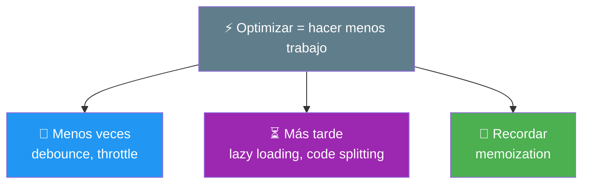
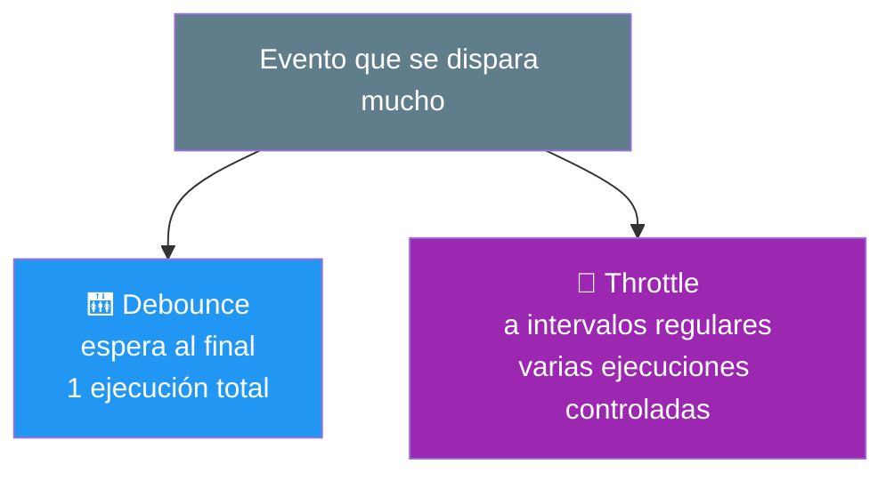
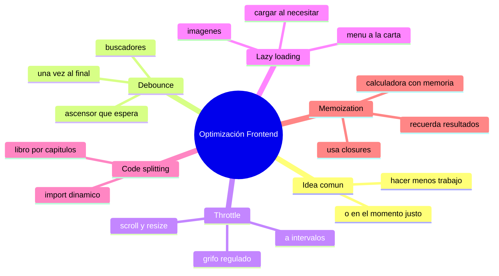

# 🧩 Módulo 34 — Optimización Frontend

> 💡 **Antes de empezar:** En el Módulo 25 aprendiste _por qué_ las apps se vuelven lentas. Hoy aprendes las _técnicas concretas_ para hacerlas rápidas y fluidas. Son trucos elegantes que los desarrolladores profesionales usan para que las apps se sientan ágiles incluso haciendo tareas exigentes. No son magia: son ideas inteligentes para hacer _menos trabajo_ o hacerlo _en el momento justo_. Es como aprender los trucos de un chef para servir más rápido sin perder calidad. 🍳⚡

---

## 🎯 ¿Qué aprenderás en este módulo?

Al terminar serás capaz de:

- Controlar funciones que se disparan demasiado con debounce y throttle.
- Cargar recursos solo cuando se necesitan (lazy loading).
- Dividir tu código en partes para cargar más rápido (code splitting).
- Recordar resultados costosos para no recalcularlos (memoization).

> 🌱 **Nota:** Estas técnicas son herramientas para _cuando_ las necesites, no reglas para aplicar siempre. Recuerda el consejo del Módulo 25: optimiza cuando detectes un problema real, no antes. Hoy llenas tu caja con soluciones para tenerlas listas.

---

## ⚡ La idea común: hacer menos, o en el momento justo

Todas las técnicas de hoy comparten una filosofía: _no hagas trabajo innecesario_. A veces eso significa hacer algo _menos veces_ (debounce, throttle), a veces _más tarde_ (lazy loading, code splitting), y a veces _recordar_ en vez de repetir (memoization).



---

## 1. Debounce: esperar a que el usuario termine

El **debounce** retrasa la ejecución de una función hasta que el usuario _deja de_ hacer algo. Útil cuando un evento se dispara muchísimas veces seguidas, pero solo te interesa el resultado _final_.

### 🛗 La metáfora del ascensor que espera

Un ascensor inteligente no arranca en cuanto la primera persona entra: _espera unos segundos_ por si llega alguien más. Solo cuando nadie más entra, cierra y sube. El debounce hace lo mismo: espera a que paren los eventos antes de actuar, evitando esfuerzos repetidos.

```javascript
// El clásico ejemplo: un buscador que NO busca con cada tecla
function debounce(funcion, espera) {
  let temporizador;
  return function (...args) {
    clearTimeout(temporizador);  // cancela el anterior
    temporizador = setTimeout(() => funcion(...args), espera);
  };
}

const buscar = debounce((texto) => {
  console.log("Buscando:", texto);  // solo se ejecuta al dejar de escribir
}, 500);

// Aunque el usuario teclee 20 veces, "buscar" se ejecuta UNA vez,
// medio segundo después de que pare de escribir.
```

> 🔍 **El problema que resuelve:** Sin debounce, un buscador haría una petición _con cada tecla_ (20 peticiones para escribir "manzana verde"). Con debounce, espera a que el usuario termine y hace _una sola_ petición. Menos trabajo, mejor rendimiento, servidor más feliz.

> 💡 **Usos típicos:** buscadores en vivo, validación de formularios mientras se escribe, guardar borradores automáticamente. Cualquier cosa donde solo importe el "resultado final" tras una ráfaga de eventos.

---

## 2. Throttle: limitar la frecuencia

El **throttle** limita cuántas veces puede ejecutarse una función en un periodo. A diferencia del debounce (que espera al final), el throttle ejecuta _a intervalos regulares_ durante el evento.

### 🚰 La metáfora del grifo regulado

Imagina un grifo que, por más que abras, solo deja salir una gota por segundo. El throttle es ese regulador: aunque el evento ocurra cientos de veces por segundo, la función se ejecuta _como máximo_ una vez cada cierto tiempo. Controla el caudal.

```javascript
function throttle(funcion, limite) {
  let esperando = false;
  return function (...args) {
    if (!esperando) {
      funcion(...args);
      esperando = true;
      setTimeout(() => (esperando = false), limite);
    }
  };
}

// Ejemplo: reaccionar al scroll, pero no en CADA pixel
const alScroll = throttle(() => {
  console.log("Posición del scroll revisada");
}, 200);  // como máximo una vez cada 200ms

window.addEventListener("scroll", alScroll);
```

> 🔍 **Debounce vs Throttle (la diferencia clave):**
> 
> - **Debounce:** espera a que _todo pare_ y ejecuta una vez al final. (Buscador: busca cuando dejas de escribir).
> - **Throttle:** ejecuta a _intervalos regulares_ durante el evento. (Scroll: revisa la posición cada 200ms mientras te mueves).



> 💡 **Usos típicos del throttle:** eventos de scroll, redimensionar la ventana, mover el ratón, juegos. Donde necesitas reaccionar _durante_ el evento, pero no en cada microsegundo.

---

## 3. Lazy Loading: cargar solo lo que se necesita

El **lazy loading** (carga perezosa) consiste en _no_ cargar recursos hasta que de verdad se necesitan. En vez de cargar todo de golpe al inicio, cargas las cosas cuando el usuario va a usarlas.

### 🍽️ La metáfora del buffet vs el menú a la carta

Cargar todo al inicio es como un buffet: preparas _toda_ la comida aunque nadie la pida, gastando recursos. El lazy loading es como un menú a la carta: cocinas cada plato _cuando_ el cliente lo pide. Más eficiente y rápido al empezar.

```html
<!-- Las imágenes con loading="lazy" cargan solo al acercarse a la pantalla -->

```

> 🔍 **El caso más común:** Una página con 50 imágenes. Sin lazy loading, el navegador descarga _las 50_ al abrir, aunque el usuario solo vea las primeras. Con lazy loading, descarga solo las visibles, y el resto _cuando_ el usuario hace scroll hacia ellas. La página abre muchísimo más rápido.

> 🔗 **Conexión:** ¿Recuerdas el Intersection Observer del Módulo 28? Es justo lo que se usa para implementar lazy loading personalizado: detecta cuándo una imagen está por aparecer y _entonces_ la carga. Para imágenes, el atributo `loading="lazy"` lo hace automáticamente sin código.

> 💡 **Más allá de imágenes:** También se aplica a videos, y —combinado con el code splitting que viene ahora— a partes enteras de tu aplicación.

---

## 4. Code Splitting: dividir el código en trozos

El **code splitting** (división de código) consiste en partir tu aplicación en varios "trozos" que se cargan por separado, en vez de un único archivo gigante que el usuario debe descargar entero al inicio.

### 📚 La metáfora del libro por capítulos

Imagina que para leer un libro tuvieras que descargar _todas_ sus 1000 páginas antes de empezar. Lento y agotador. El code splitting es como recibir el libro _capítulo por capítulo_: lees el primero de inmediato, y los siguientes llegan cuando avanzas. Empiezas rápido y cargas el resto sobre la marcha.

```javascript
// En vez de importar todo al inicio...
// import { funcionPesada } from "./modulo-pesado.js";

// ...lo importamos SOLO cuando se necesita (import dinámico)
boton.addEventListener("click", async () => {
  const modulo = await import("./modulo-pesado.js");
  modulo.funcionPesada();
});
```

> 🔍 **Cómo funciona:** El `import(...)` dinámico (con paréntesis, dentro de una función) carga ese trozo de código _solo cuando se ejecuta esa línea_, no al inicio. Así, el usuario descarga primero lo esencial (la app arranca rápido) y lo demás llega cuando hace falta.

> 🎯 **El beneficio:** Una app grande puede tardar en cargar si todo viene en un solo archivo. Dividiéndola, el usuario ve la pantalla inicial _al instante_, y las partes pesadas (un editor complejo, un gráfico avanzado) se cargan solo si las usa. Herramientas como Vite (Módulo 32) facilitan mucho esto.

---

## 5. Memoization: recordar para no repetir

La **memoization** consiste en _guardar_ el resultado de una función costosa para que, si se la llama otra vez con los mismos argumentos, devuelva el resultado guardado en vez de recalcularlo.

### 🧠 La metáfora de la calculadora con memoria

Imagina que te preguntan "¿cuánto es 347 × 892?". Lo calculas con esfuerzo. Si te lo preguntan _de nuevo_, no vuelves a calcularlo: recuerdas la respuesta y la das al instante. La memoization es esa memoria: recuerda resultados ya calculados para no repetir el trabajo.

```javascript
function memoizar(funcion) {
  const cache = {};  // aquí guardamos resultados ya calculados
  return function (n) {
    if (n in cache) {
      return cache[n];  // ya lo calculamos: lo devolvemos al instante
    }
    const resultado = funcion(n);
    cache[n] = resultado;  // lo guardamos para la próxima
    return resultado;
  };
}

// Una función "costosa" de ejemplo
const calcularLento = memoizar((n) => {
  console.log("Calculando...");  // solo aparece la PRIMERA vez por valor
  return n * 2;
});

console.log(calcularLento(5));  // "Calculando..." → 10
console.log(calcularLento(5));  // 10 (¡sin recalcular! viene de la memoria)
```

> 🔍 **Cuándo brilla:** Para funciones que hacen cálculos pesados y se llaman _repetidamente con los mismos datos_. En vez de recalcular cada vez, recuerdas. Es un intercambio: usas un poco de memoria (la "cache") para ahorrar tiempo de cálculo.

> 💡 **Conexión:** ¿Recuerdas los closures del Módulo 19? La memoization los usa: la función "recuerda" su cache gracias al closure. Ahora ves un uso real y poderoso de ese concepto que parecía abstracto.

> ⚠️ **No siempre conviene:** Memoizar tiene sentido para cálculos _costosos y repetidos_. Para funciones simples y rápidas, no vale la pena (gastarías memoria sin ganar tiempo). Como toda optimización, úsala donde de verdad ayude.

---

## 🧭 El kit de optimización completo

|Técnica|Qué hace|Cuándo usarla|Metáfora|
|---|---|---|---|
|**Debounce**|Espera a que paren los eventos|Buscadores, validación|Ascensor que espera|
|**Throttle**|Limita la frecuencia|Scroll, resize, ratón|Grifo regulado|
|**Lazy loading**|Carga al necesitar|Imágenes, videos|Menú a la carta|
|**Code splitting**|Divide el código|Apps grandes|Libro por capítulos|
|**Memoization**|Recuerda resultados|Cálculos pesados repetidos|Calculadora con memoria|

> 🧠 **El hilo conductor:** Todas responden a la misma pregunta: _"¿cómo hago menos trabajo o lo hago en el mejor momento?"_. Esa mentalidad —no desperdiciar esfuerzo— es la esencia de la optimización.

---

## 🛠️ Mini práctica: ¡tu turno!

Algunos ejercicios funcionan en la consola; otros necesitan un archivo HTML. 🧪

### Ejercicio 1 — Debounce en un buscador

```html
<!DOCTYPE html>
<html>
<body>
  <input type="text" id="buscar" placeholder="Escribe algo...">
  <p id="estado"></p>

  <script>
    function debounce(fn, espera) {
      let t;
      return (...args) => {
        clearTimeout(t);
        t = setTimeout(() => fn(...args), espera);
      };
    }

    const estado = document.querySelector("#estado");
    const buscar = debounce((texto) => {
      estado.textContent = "Buscando: " + texto;
    }, 600);

    document.querySelector("#buscar").addEventListener("input", (e) => {
      buscar(e.target.value);
    });
  </script>
</body>
</html>
```

> 🔍 **Prueba:** Escribe rápido y observa. El mensaje "Buscando" solo aparece cuando _dejas_ de escribir por un momento. ¡Eso es debounce!

### Ejercicio 2 — Lazy loading de imágenes

```html

```

> 🎯 **Reto:** Crea una página con muchas imágenes usando `loading="lazy"`. Abre las DevTools → pestaña **Network** y observa cómo las imágenes se cargan _a medida que haces scroll_, no todas de golpe.

### Ejercicio 3 — Reflexión

Piensa en tus proyectos: el buscador en vivo del Módulo 6, por ejemplo. Si hubiera hecho una petición a internet con _cada tecla_, ¿qué problema habría? ¿Cómo lo arreglaría el debounce? Conectar las técnicas con tus proyectos reales las hace memorables.

---

## 🧭 Resumen visual del módulo



---

## ✅ Checklist: ¿lo lograste?

- [ ] Uso debounce para esperar a que el usuario termine de actuar.
- [ ] Uso throttle para limitar la frecuencia de una función.
- [ ] Distingo claramente debounce (al final) de throttle (a intervalos).
- [ ] Aplico lazy loading para cargar recursos solo al necesitarlos.
- [ ] Entiendo el code splitting para dividir apps grandes.
- [ ] Uso memoization para recordar resultados costosos.

Si marcaste la mayoría, **tienes el kit de optimización de un desarrollador profesional**. 💪

---

## 🌱 Reflexión final

Este módulo te dio un conjunto de técnicas elegantes que comparten una sabiduría sencilla: _el código más rápido es el que no se ejecuta_. Debounce y throttle evitan trabajo repetido; lazy loading y code splitting posponen lo que no se necesita aún; memoization recuerda en vez de recalcular. Todas nacen de pensar con astucia _cuándo_ y _cuánto_ trabajo hacer.

Pero recuerda la lección de oro del Módulo 25, que aplica aquí más que nunca: **no optimices antes de tiempo**. Estas técnicas son maravillosas _cuando resuelven un problema real_, pero aplicarlas en todas partes sin necesidad complica tu código sin beneficio. La sabiduría no está en usar todas siempre, sino en reconocer _cuándo_ una de ellas encaja: "este buscador hace demasiadas peticiones → debounce"; "esta página tiene 100 imágenes → lazy loading". Primero construye claro y funcional; optimiza con bisturí donde duela.

Y mira cómo se entrelaza todo: la memoization usa los closures (Módulo 19), el lazy loading usa el Intersection Observer (Módulo 28), el code splitting brilla con Vite (Módulo 32), y todo se apoya en entender el rendimiento (Módulo 25). Conceptos que parecían sueltos ahora forman un tejido coherente. Eso es señal de que tu conocimiento está madurando de piezas aisladas a un entendimiento integrado.

> 🎯 **El secreto sigue siendo el mismo:** un pasito a la vez. Hoy aprendiste a hacer que tus apps vuelen, con astucia más que con fuerza bruta. Pero la mayor sabiduría es saber _cuándo_ aplicar cada truco: la optimización es un bisturí, no un martillo.

**¡Nos vemos en el Módulo 35!**